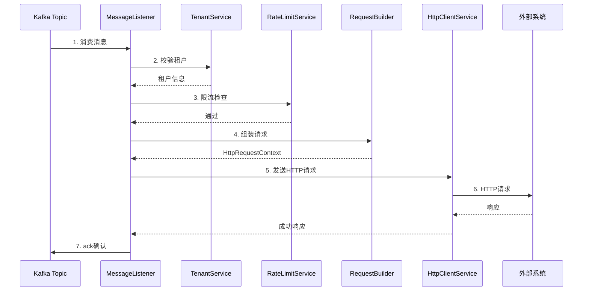
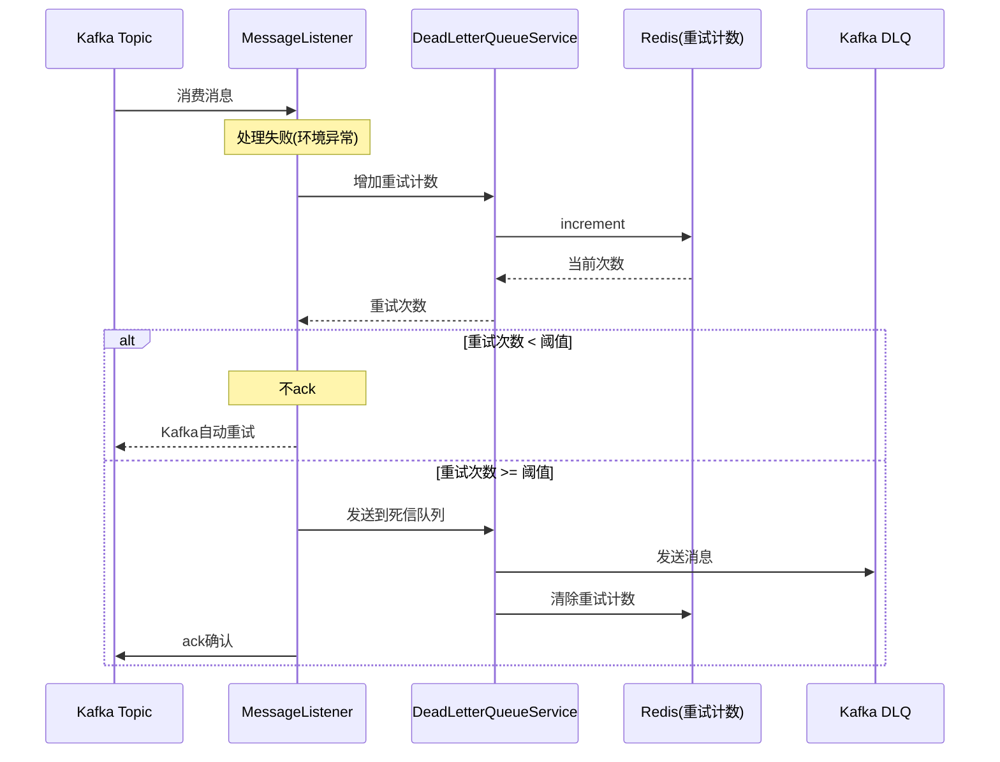

# 项目概述
该系统是一个Java开发的外部Http调用的适配服务。业务系统调用本系统，提供需要的参数，根据参数不同调用对应外部http服务

系统本身不关心外部Http请求的返回值以及异常信息，但需要感知网络超时、请求不通等环境异常
# 架构及核心设计

## 系统架构图

```
┌─────────────────────────────────────────────────────────────────────────────────┐
│                                   业务系统                                        │
└─────────────────────────────────┬───────────────────────────────────────────────┘
                                  │ 发送消息
                                  ▼
┌─────────────────────────────────────────────────────────────────────────────────┐
│                              Kafka Topic                                         │
│                         (http-adapter-request)                                   │
└─────────────────────────────────┬───────────────────────────────────────────────┘
                                  │ 消费消息
                                  ▼
┌─────────────────────────────────────────────────────────────────────────────────┐
│                           HTTP Adapter Service                                   │
│  ┌───────────────────────────────────────────────────────────────────────────┐  │
│  │                        AdapterMessageListener                              │  │
│  │                         (Kafka消息监听器)                                   │  │
│  └─────────────────────────────────┬─────────────────────────────────────────┘  │
│                                    │                                             │
│                                    ▼                                             │
│  ┌─────────────┐  ┌─────────────┐  ┌─────────────┐  ┌─────────────────────────┐ │
│  │ TenantSvc   │  │ ApiConfig   │  │ RateLimit   │  │    ConfigCache          │ │
│  │ (租户校验)   │  │ Svc(配置)   │  │ Svc(限流)   │  │    (Guava缓存)          │ │
│  └──────┬──────┘  └──────┬──────┘  └──────┬──────┘  └─────────────────────────┘ │
│         │                │                │                                      │
│         └────────────────┼────────────────┘                                      │
│                          ▼                                                       │
│  ┌───────────────────────────────────────────────────────────────────────────┐  │
│  │                          RequestBuilder                                    │  │
│  │                    (请求组装: Header/Body/Query/Path)                       │  │
│  └─────────────────────────────────┬─────────────────────────────────────────┘  │
│                                    │                                             │
│                                    ▼                                             │
│  ┌───────────────────────────────────────────────────────────────────────────┐  │
│  │                         HttpClientService                                  │  │
│  │                      (OkHttp + 连接池 + 重试)                               │  │
│  └─────────────────────────────────┬─────────────────────────────────────────┘  │
│                                    │                                             │
│         ┌──────────────────────────┼──────────────────────────┐                  │
│         ▼                          ▼                          ▼                  │
│  ┌─────────────┐           ┌─────────────┐           ┌─────────────────────┐    │
│  │ RequestLog  │           │  成功返回    │           │  DeadLetterQueue   │    │
│  │ Svc(日志)   │           │             │           │  Svc(死信队列)      │    │
│  └──────┬──────┘           └─────────────┘           └──────────┬──────────┘    │
│         │                                                       │               │
└─────────┼───────────────────────────────────────────────────────┼───────────────┘
          │                                                       │
          ▼                                                       ▼
┌─────────────────┐                                    ┌─────────────────────────┐
│     MySQL       │                                    │      Kafka DLQ          │
│  (配置/日志)     │                                    │ (http-adapter-request-  │
│                 │                                    │        dlq)             │
└─────────────────┘                                    └─────────────────────────┘
          │
          │
┌─────────────────┐
│     Redis       │
│ (限流/重试计数)  │
└─────────────────┘

                                  │
                                  │ HTTP请求
                                  ▼
┌─────────────────────────────────────────────────────────────────────────────────┐
│                              外部三方系统                                         │
│                    (根据租户配置的URL发送请求)                                     │
└─────────────────────────────────────────────────────────────────────────────────┘
```

## 核心处理流程（时序图）

### 正常处理流程



### 异常处理流程



### 异常类型说明

| 异常类型 | 处理方式 |
|---------|---------|
| BusinessException | 直接ack，不重试（配置错误、租户不存在等） |
| RateLimitException | 直接ack，不重试（限流触发） |
| RetryableException | 根据重试次数决定重试或进入死信队列 |

## 消息体结构

```json
{
  "tenantCode": "租户识别码",
  "apiCode": "接口编码",
  "traceId": "链路追踪ID",
  "messageBody": {
    "业务数据字段": "值"
  },
  "userInfo": {
    "userId": "用户ID",
    "userName": "用户名",
    "extra": {}
  }
}
```

## 设计要点

- **同步请求**: 采用同步方式向外部系统请求，等待返回值
- **重试机制**: HTTP层指数退避重试 + Kafka消息级重试
- **异常分类**: 区分业务异常(不重试)和环境异常(重试)
- **死信队列**: 重试超过阈值后进入死信队列，避免无限重试


# 工程决策

## 租户
有可能会有不同业务方调用同一个外部服务，但是外部服务的部分参数不同，所以需要考虑增加租户的概念，存储不同业务的配置

## 管理系统
由于有不同的租户及配置，以及可能会动态增加的外部调用方，需要增加一个简单的管理系统，用户在自己租户内增加外部调用方，参数格式。使用mysql作为数据储存

## 业务方登录、鉴权
背景信息过少，暂不考虑（可能已有对应系统，用户身份获取通过rpc调用即可）

## MQ
由于业务系统不关心返回值，但是需要保证通信的成功（增加重试机制），MQ更适合当前系统。采用kafka作为MQ系统提供者

- 优点：有稳定的重试机制。复杂度低，如果自行定义rpc接口，需要在重试过程中关注rpc超时、重试时上下文处理等问题，复杂度较高
- 缺点：业务方无法自定义重试次数、间隔等配置。无法自定义不需要重试的情况

## 限流
如果业务方出现问题或者业务量增加可能会出发频繁调用外部系统，对系统本身和业务方可能都存在安全隐患。需要设置默认请求频率以及限流后给业务方的错误响应。

由于系统边界原因，认为初期不需要考虑增加限流后的补偿措施（例如先接收请求，存储，之后再重试）。但需要保证消息重试接口的独立性，方便后续增加该功能后能方便发起重试

## 报警
对于限流或者网络不可用等问题造成的频繁处理失败，可以增加报警机制。

由于系统边界原因，认为初期不需要增加报警功能，但需要增加埋点等功能，在后续增加该功能或者调用已有报警系统时，能够快速拓展